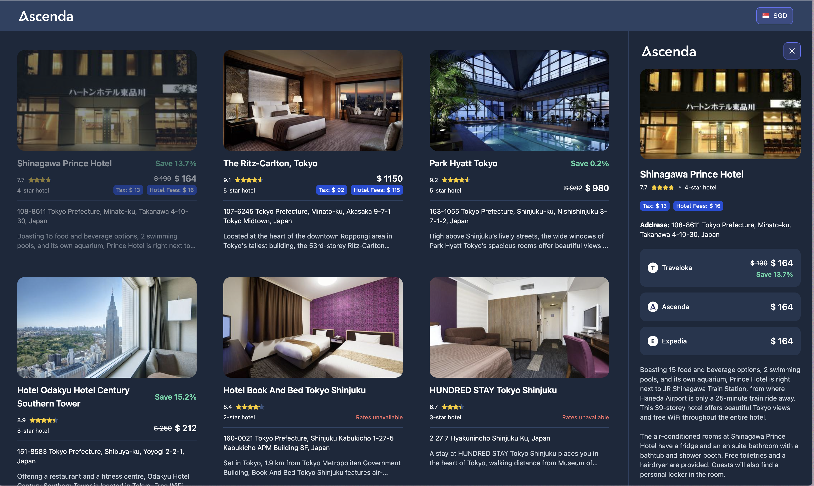

<h1 align="center">Ascenda Hotel Currencies & Price Competitiveness</h1>
<p align="center">
  
</p>

<p align="center">
  <a href="https://pnpm.io/">
    
  </a>
  <a href="https://angular.io/">
    
  </a>
  <a href="https://tailwindcss.com/">
    
  </a>
  <a href="https://developer.mozilla.org/en-US/docs/Web/HTML">
    
  </a>
  <a href="https://sass-lang.com/">
    
  </a>
  <a href="https://jestjs.io/">
    
  </a>
  <a href="https://nx.dev/">
    
  </a>
  <a href="https://www.typescriptlang.org/">
    
  </a>
  <br />
  
</p>

## 🖼️ [Demo](https://vinhdk.github.io/ascenda-hotel)

**⚠️ Warning: Viettel network is loading for forever when you try to access apis. Consider using a VPN to avoid this issue.**


<br />
<br />


## 💻 Platforms

- ✅ **Mobile 📱**
- ✅ **Desktop 💻**

## 📌 Features

- ✅ **Currency Switcher** – Switch between different currencies.
- ✅ **Currency Comparison** – Compare hotel prices across multiple currencies.
- ✅ **View Detailed Hotel Information** – View detailed information about each hotel.
- ✅ **Taxes and Fees** – Able to view taxes and fees for each hotel.
- ✅ **Fully Tested** – Ensures reliability with **Jest** unit tests.

## ⛩️ How to use

1. Click on the currency switcher to select the currency you want to use.
2. Click on the hotel card to view the detailed information about the hotel.

---

## 🚀 Getting Started

Follow these steps to set up the project on your local machine.

---

## ⚡ Prerequisites

Ensure you have the following installed:

- **Node.js** (version 20 or later) – [Download Here](https://nodejs.org/) or use **NVM**
- **pnpm** (version 8 or later) – Install via:
  ```sh
  brew install pnpm  # macOS
  npm install -g pnpm # Windows/Linux
  ```

---

## 🔐 Configuring SSH & GPG for Secure Access

This repository **requires SSH for cloning** and **signed commits using GPG**.

- **Set up SSH**: Follow the official [GitHub SSH Guide](https://docs.github.com/en/authentication/connecting-to-github-with-ssh)
- **Set up GPG for signed commits**: Follow the [GitHub GPG Guide](https://docs.github.com/en/authentication/managing-commit-signature-verification)

---

## 🛠️ Setup

1. **Clone the Repository using SSH**

   ```sh
   git clone git@github.com:vinhdk/ascenda-hotel.git
   cd ascenda-hotel
   ```

2. **Install Dependencies**

   ```sh
   pnpm install
   ```

---

## 🎯 Running the Project

### 🔥 Development Mode

```sh
pnpm start
```

This will start a local dev server at `http://localhost:4200/`.

### 🏗️ Build for Production

```sh
pnpm build
```

The production-ready files will be available in the [Browser](./dist/ascenda-hotel/browser) folder.

### 🧪 Running Tests

```sh
pnpm test
```

Runs unit tests using **Jest**.

---

## ⚙️ Tooling & Conventions

We are using the following tools and configurations to ensure code quality and maintainability:

- **pnpm** (version 8+) – Efficient package manager
- **Node.js** (version 20+) – Runtime environment
- **Prettier** – Code formatting
- **ESLint** – Linting for consistent code style
- **Husky** – Pre-commit and commit-msg hooks
- **Commitlint** – Enforces commit message conventions
- **Nx** – Monorepo management
- **Angular 19** – Frontend framework
- **Signed Commits** – All commits must be signed using **GPG**

---

## 📁 Project Structure

```plaintext
📂 ascenda-hotel
 ├── 📂 public (Static files, e.g., favicon, assets)
 ├── 📂 src
 │   ├── 📂 app
 │   │   ├── 📂 components
 │   │   ├── 📂 containers
 │   │   ├── 📂 enums
 │   │   ├── 📂 injectors
 │   │   ├── 📂 interfaces
 │   │   ├── 📂 pipes
 │   │   ├── 📂 types
 │   │   ├── 📂 utils
 │   │   ├── app.config.ts
 │   │   └── app.component.ts
 │   ├── styles.scss
 │   ├── main.ts
 │   ├── index.html
 ├── 📜 package.json
 ├── 📜 package-lock.json
 ├── 📜 README.md
 ├── 📜 CONTRIBUTING.md
 ├── 📜 .npmrc
 ├── 📜 .prettierrc
 ├── 📜 eslint.config.mjs
 ├── 📜 jest.config.ts
 ├── 📜 tailwind.config.js
 ├── 📜 nx.json
 ├── 📜 project.json
 └── 📜 tsconfig.json
```

---

## 🏆 Contribution

- **Fork the repository** and create a new branch.
- Follow the project’s [Coding Standards](./CONTRIBUTING.md).
- Submit a **Pull Request** for review.

---

## 📧 Contact & Support

If you have any questions or issues, feel free to open an **issue** or reach out via email.

**✉️ Email**: [anlalayker@gmail.com](mailto:anlalayker@gmail.com)
